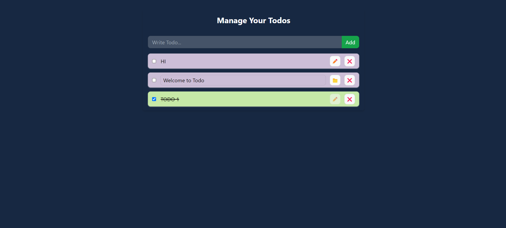

# React Todo App with Vite and Tailwind CSS

This is a simple Todo application built using React, Vite, and Tailwind CSS. It allows you to manage your tasks efficiently.

## Features

- Add new tasks with titles.
- Update existing tasks.
- Mark tasks as completed.
- Delete tasks you no longer need.

## Technology Stack

- React: A JavaScript library for building user interfaces.
- Vite: A build tool that provides a faster and leaner development experience for modern web projects. It includes a dev server with features like Hot Module Replacement (HMR) and a build command using Rollup for optimized static assets.
- Tailwind CSS: A utility-first CSS framework for rapidly building custom user interfaces.

## Getting Started

Follow these instructions to get the project up and running on your local machine.

### Prerequisites

- Node.js installed on your computer.

### Installation

1. Clone the repository:

   ```sh
   git clone https://github.com/your-username/react-todo-app.git
   ```

2. Change to the project directory:

   ```sh
   cd react-todo-app
   ```

3. Install the dependencies:

   ```sh
   npm install
   ```

4. Start the development server:

   ```sh
   npm run dev
   ```

The app will be available at [http://localhost:5173](http://localhost:5173).

## Usage

1. Add a new task by entering a title and clicking the "Add" button.
2. Update a task by clicking the "Edit" button.
3. Mark a task as completed by clicking the checkbox.
4. Delete a task by clicking the "Delete" button.

## Local Storage

The app uses local storage to save your tasks. Your tasks will persist even after you close the app or refresh the page.

## Images


